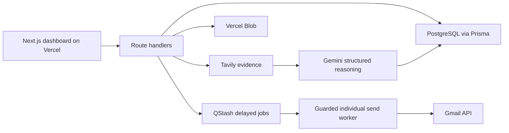

# ColdMailOS

ColdMailOS is a private, full-stack cold outreach workspace for Om Patil. It imports HR contacts, researches companies with Tavily, uses Gemini to classify and personalize, creates a company-matched résumé and email, and creates Gmail drafts. Sending is always a separate, manually approved action.

## Product features

- Owner-only authenticated dashboard with analytics, priority scoring, category charts, and activity logs
- Excel/CSV campaign import, automatic column detection, editable mapping, 20-row preview, and email validation
- Source-grounded Tavily research with Gemini JSON classification, citations, confidence scores, and manual-review stops
- Immutable original LaTeX résumé plus editable working templates and company-specific `.tex`/PDF artifacts
- Personalized email and follow-up generation with edit/approve workflow
- Gmail OAuth, encrypted refresh tokens, per-contact MIME attachments, labels, drafts, and sends
- Draft-only mode, daily limit, inter-send delay, typed confirmation, per-row validation, and high-error-rate circuit breaker
- Single-company mode and Excel, CSV, ZIP, and log exports

## Stack

- Next.js App Router, React 19, TypeScript, Tailwind CSS
- Prisma with PostgreSQL (Neon, Supabase, or Vercel Postgres)
- TanStack Table and Recharts
- Tavily Search API and Gemini API
- Gmail API with OAuth 2.0
- Vercel Blob in production; local `public/generated` fallback
- QStash for delayed background sends; safe inline fallback for local development
- `pdf-lib` for a serverless-compatible PDF renderer
- ExcelJS/Papa Parse, Zod, and Vitest

## Architecture



The send worker re-runs deterministic quality checks immediately before every draft or send. A selected batch becomes separate delayed jobs—never one message with multiple recipients.

## Local setup

1. Install dependencies:

   ```bash
   npm install
   ```

2. Copy `.env.example` to `.env` and fill in at least `DATABASE_URL`, `NEXTAUTH_SECRET`, `ENCRYPTION_KEY`, and `COLDMAILOS_ADMIN_PASSWORD`.

3. Create the database client and schema:

   ```bash
   npx prisma generate
   npx prisma migrate dev --name init
   ```

4. Start the app:

   ```bash
   npm run dev
   ```

Open [http://localhost:3000](http://localhost:3000). The default Om profile is created on first use.

## Environment variables

See [.env.example](./.env.example). Important values:

- `DATABASE_URL`: pooled PostgreSQL connection URL
- `TAVILY_API_KEY`, `GEMINI_API_KEY`: optional environment defaults; keys entered in Settings are AES-256-GCM encrypted in the database
- `GOOGLE_CLIENT_ID`, `GOOGLE_CLIENT_SECRET`, `GOOGLE_REDIRECT_URI`: Gmail OAuth client
- `NEXTAUTH_SECRET`: signs owner sessions and authenticates internal job callbacks
- `ENCRYPTION_KEY`: a long independent secret used for API keys and OAuth tokens
- `BLOB_READ_WRITE_TOKEN`: Vercel Blob uploads
- `QSTASH_TOKEN`: production delayed-send queue
- `NEXTAUTH_URL`: canonical application URL used by QStash callbacks
- `COLDMAILOS_ADMIN_PASSWORD`: owner login password

Do not prefix server secrets with `NEXT_PUBLIC_`.

## Database

Create a PostgreSQL project in Neon, Supabase, or Vercel Postgres and copy its pooled connection string into `DATABASE_URL`. Run `npx prisma migrate deploy` during production deployment. The schema includes profiles, encrypted credentials, immutable résumé sources, campaigns, contacts, research, generated artifacts, Gmail delivery records, background jobs, and activity logs.

## Tavily and Gemini

You can configure both keys in Vercel environment variables or enter them on `/settings`. Saved keys are encrypted and are never returned to the browser.

Research runs four queries per unique company and sends the deduplicated results to Gemini. The prompt requires evidence-only JSON. Returned source URLs are filtered against the URLs Tavily actually provided. Research below 60% confidence is always marked for manual review.

Gemini is also used for conservative LaTeX tailoring and concise email generation. Deterministic code still checks company mention, length, research state, approval state, and attachment identity.

## Gmail OAuth

1. Create a Google Cloud project and enable the Gmail API.
2. Configure the OAuth consent screen. For a personal app in testing, add Om's Gmail account as a test user.
3. Create a Web OAuth client.
4. Add the exact redirect URI from `GOOGLE_REDIRECT_URI`, for example:

   ```text
   http://localhost:3000/api/gmail/oauth/callback
   https://your-domain.vercel.app/api/gmail/oauth/callback
   ```

5. Add the client ID and secret to the environment, deploy, then use **Connect Gmail** on `/settings`.

OAuth tokens are encrypted before database storage. The app requests Gmail compose and label scopes, not full mailbox access.

## Using campaigns

1. Go to `/upload`, choose `.xlsx`, `.xls`, or `.csv`, and click **Detect columns**.
2. Verify HR name, HR email, company, website, LinkedIn, and notes mappings.
3. Create the campaign and open its approval table.
4. Select rows and run research, résumé generation, and email generation.
5. Open **Review email**, edit if needed, and click **Save & approve**. This can explicitly resolve a manual-review warning.
6. Use **Create Drafts** for safe Gmail drafts, or disable draft-only mode and use the guarded send action.

Duplicates are preserved when emails differ. Invalid emails remain visible and are marked for review.

## Safe Send Approved behavior

The send button only considers selected contacts whose latest email is approved. The confirmation modal lists individual recipients and requires the exact text `CONFIRM`.

Before each send, the server verifies:

- valid HR email and non-empty company
- generated and approved email
- correct company mention and maximum length
- completed PDF and exact company-specific filename
- resolved research/email review flags
- connected Gmail account
- draft-only setting and daily send limit

Each contact becomes an independent QStash job with the configured delay. The MIME message has exactly one `To` address and its own PDF. There is no CC/BCC bulk path. A 50% failure rate after three attempts pauses the campaign.

Without QStash, local development processes the same jobs sequentially in the request. Use QStash in production to avoid Vercel execution limits.

## Single-company mode

`/single` accepts one HR email and company. Research creates a one-contact campaign, then generates the résumé and email. The final button opens the standard approval dashboard, so single mode cannot bypass any safety checks.

## Résumé generation and LaTeX on Vercel

The original `.tex` source is stored separately from its editable working copy. Every company receives a new tailored `.tex` file and a separately named PDF such as `Om_Patil_Resume_Impact_Analytics.pdf`.

Vercel functions do not provide a reliable full TeX installation. ColdMailOS therefore uses a serverless `pdf-lib` résumé renderer for the attached PDF while retaining Gemini-tailored LaTeX as an editable/downloadable artifact. This avoids Chromium and native LaTeX binaries. If pixel-identical LaTeX output is required, replace `src/lib/resume-renderer.ts` with a call to a Railway/Render worker or hosted TeX compilation API; keep the same storage and filename contract.

## Exports

`/export` provides the full tracker workbook, generated emails CSV, résumé ZIP, and campaign logs CSV. The tracker includes research, scoring, artifact URLs, delivery state, review flags, and errors.

## Tests

```bash
npm test
```

Tests cover spreadsheet mapping, email validation, company normalization, Tavily result parsing, Gemini JSON recovery, priority scoring, filename sanitization, résumé-company matching, prompt constraints, Gmail MIME payloads, and one-by-one send scheduling.

## Vercel deployment

1. Push the repository and import it in Vercel.
2. Provision PostgreSQL and Blob, then add all environment variables.
3. Set the production Gmail redirect URI and `NEXTAUTH_URL`.
4. Add QStash and its `QSTASH_TOKEN`.
5. Run `npx prisma migrate deploy` against production once.
6. Deploy. The build command is `npm run build`.

## Troubleshooting

- **Unauthorized:** set `COLDMAILOS_ADMIN_PASSWORD` and sign in again; rotate `NEXTAUTH_SECRET` only when intentionally invalidating sessions.
- **Encryption error:** set a stable `ENCRYPTION_KEY`; changing it makes existing saved credentials unreadable.
- **Gmail redirect mismatch:** ensure the Google Console URI exactly matches `GOOGLE_REDIRECT_URI`.
- **Draft blocked:** open the row’s email review, approve it, resolve any manual-review flag, and confirm a completed matched PDF exists.
- **No files after a Vercel restart:** configure Vercel Blob. The filesystem fallback is only for local development.
- **Batch timeout:** configure QStash. Long research/generation batches should likewise be moved to scheduled jobs if campaign sizes routinely exceed Vercel function duration.
- **Low-confidence company:** inspect cited sources and edit/resolve the row; ColdMailOS intentionally does not auto-promote uncertain research.
